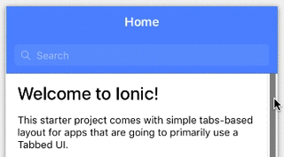
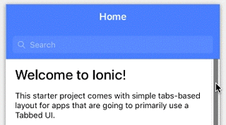
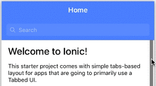
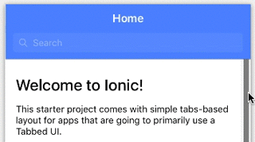

# Ionic Scroll Hide

This plugin was inspired by [Ionic Scroll Sista](https://github.com/djett41/ionic-scroll-sista). Tested in Ionic 2 and 3.

## Setup

1. Install jQuery library
```
npm install --save jquery
```
2. Copy `scroll-hide` folder into your Ionic project (src/components).
3. Add `ScrollHide` class to the declarations NgModule metadata (`app.module.ts`).
```typescript
import { ScrollHide } from './../components/scroll-hide/scroll-hide';

@NgModule({
	declarations: [
		MyApp,
		...
		ScrollHide,
	],
    ...
})
export class AppModule { }
```

## Usage

Scroll Hide is an attribute directive, and requires an input of `viewCtrl`. So, rememeber to inject ViewController into the page constrcutor. To enable the plugin, add `[scroll-hide]="viewCtrl"` into `ion-content`.


There are three transistion types can be used for each `ion-toolbar`, they are `Static`, `Translate`, `Shrink`.

#### Static
The toolbar would not be translated and shrinked during scrolling. It is the default type.



#### Translate
The toolbar would be translated during scrolling. To enable, add an attribute of `scroll-hide-translate` into ion-toolbar.



#### Shrink
The toolbar would be shrinked during scrolling. To enable, add an attribute of `scroll-hide-shrink="shrinkVal"` into ion-toolbar, where `shrinkVal` is the maximum percentage of shrinking, defualt to 1.

|shrinkVal = 1						| shrinkVal = 0.5						|
------------------------------------|---------------------------------------|
|	| 	|


## Example

```html
<ion-header>
	<ion-navbar color="primary">
		<ion-title>Home</ion-title>
	</ion-navbar>
	
	<ion-toolbar color="primary" scroll-hide-translate>
		<ion-searchbar></ion-searchbar>
	</ion-toolbar>
</ion-header>

<ion-content padding [scroll-hide]="viewCtrl">
	<h2>Welcome to Ionic!</h2>
</ion-content>
```